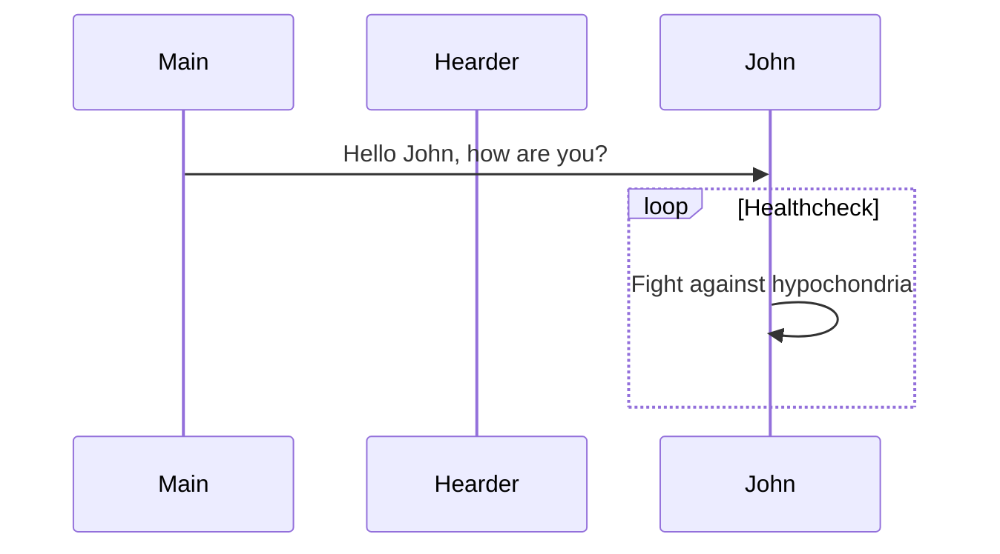

# Gioi thieu day la h1
1. list 1
2. list 2
    - sub 1
    - sub 2

## Day la h2

# Fotmating
1. **Boi dam**
2. *in nghieng*
3. ~~gach ngang~~
4. boi den doan van nay `duoc boi den`
5. > day la mot quotation

## Table
| STT  | Name  |       Nam |
| :--- | ----- | --------: |
| 1    | Vuong | 25/081991 |
| 2    | Son   |      1991 |

## Hinh anh

<!--  -->

# Math 
$x=(y^2)/(z+1)$

# Link
this : google.com

# Import File
@import ".env"

# classDiaram

