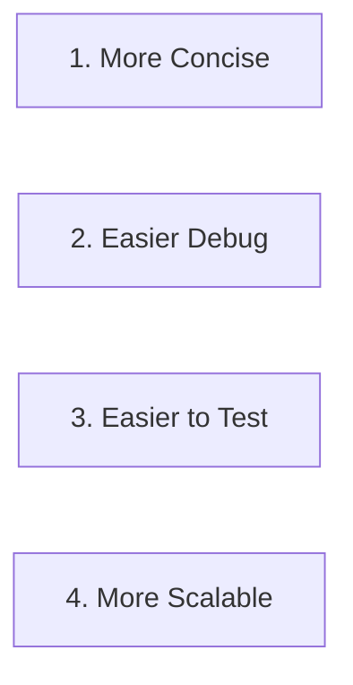

# STATE MANAGERMENT SOLUTIONS
    1. Flux (by facebook)
    2. Redux
   
# Redux (:https://www.youtube.com/watch?v=poQXNp9ItL4&t=194s)
    1. Centralizes application's state ( tap trung du lieu(state) trong [store , variabel ... ] )
    2. Makes data flow transparent and predictable (giup kiem soat state ro rang va render tung component chinh xac )
   
# Props
    1. Predictable state changes
    2. Centralized state
    3. Easy debugging
    4. Preserve page state (single page)
    5. undo/redo
    6. Ecosytem of add-ons
   
# Cons
    1. Complexity(phuc tap)
    2. Verbosity (rum ra)

# When not to use **REDUX**
    1. Type budget
    2. Small to medium-size apps
    3. Simple UI/Data flow
    4. static data

# YOU'LL LEARN
    1. Functional programming
    2. Fundamatentals of redux
    3. Buil Redux from scratch
    4. Debugging
    5. Writing clear code
    6. Redux store
    7. Middleware
    8. Calling Apis
    9. Testing Redux apps
    10. Integration with React

# PROGRAMMING PARADIGMS
    1. Funtional
    2. Object-oriented
    3. Procesdural
    4. Event-driven

# LANGUAGES
    1. Clojure
    2. Haskell
    3. Javascript
## Function as First-class Citizens

## FUNCTIONs
    1. Assign to a variable
    2. Pass as an argument
    3. Return from other functions

# Immutability
    1. Predictability (du doan)
    2. Faster Change Detection (nhanh chong thay doi khi duoc xac dinh)
    3. Concurrency (dong thoi)
    4. Performance  (cons) => example :  const book = {} ; book.title = "..."; book.name = "..."; book.[..] =...
    5. Memory overhead (cons)

# REDUX 
    1. State
    2. Store
    3. Action
## Steps

## Store Object
    1. dispatch action=> {check action} 
    2. subscribe listener=>{ handdle}
    3. getState  return oldState
    4. replaceReducer (return new stare)